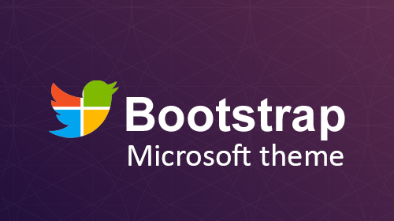

#Bootstrap Microsoft Theme



I am trying to put microsoft.com website style into a bootstrap theme.
There are still many things to do

#What's new
## Dropdown submenu
The microsoft.com website has now a new navbar with dropdowns inside other dropdowns, so I searchd on the web for a twbs solution to this.
I found an usefull snippet [you can see here](http://bootsnipp.com/snippets/featured/multi-level-dropdown-menu-bs3 "Submenu snippet") and I adapted it to response on click.
It needs bootstrap.js to work!

###Example
Here an example of its usage:

```html
  <li class="dropdown">
    <a href="#" class="dropdown-toggle" data-toggle="dropdown" role="button">Main dropdown <span class="caret"></span></a>
    <ul class="dropdown-menu">
      <li><a href="#">Some links</a></li>
      <li class="dropdown-submenu">
        <a tabindex="-1" href="#">Click here to open a submenu</a>
        <ul class="dropdown-menu">
          <li><a tabindex="-1" href="#">Inner level</a></li>
          <li class="dropdown-submenu">
            <a href="#">Go inside</a>
            <ul class="dropdown-menu">
              <li><a href="#">no limits</a></li>
            </ul>
          </li>
          <li><a href="#">Second level</a></li>
        </ul>
      </li>
    </ul>
  </li>
```
